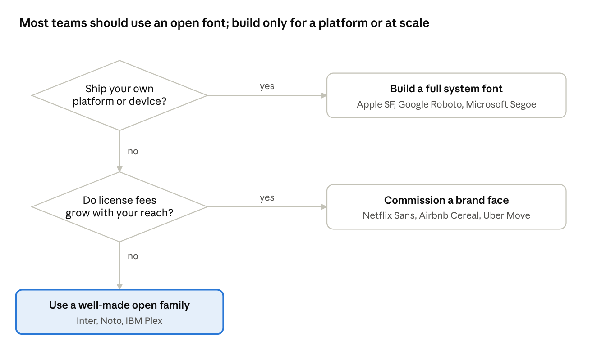

# Why Apple Built Its Own Font: San Francisco and the Hidden Logic of Corporate Typefaces

October 6, 2026 · Siddharth Agarwal

Apple built San Francisco because no font it could buy fit the job it had: one typeface that stays readable from a 1.5-inch watch face to a 32-inch display, in dozens of scripts, at every size a user can pick. The brand gain mattered, but it came second.

You read San Francisco for hours every day and almost never notice it. That is the point. A system font is not decoration. It is an interface component, as much as a button or a scroll view. It sets how fast people can scan a list, whether a notification can be read in a glance, and whether a user with low vision can use the device at all.

This piece follows Apple's choice from Helvetica to San Francisco. It then widens out to the general question: why do large technology companies spend years and millions of dollars drawing their own letters? The answer says a lot about how type works as interface, and about the trade-offs every design team faces.

## Forty years of Apple system fonts

Each change of Apple's system font followed a change in display technology. The font has always been shaped by the pixels underneath it.

| Years | System font | Designer | What drove it |
| --- | --- | --- | --- |
| 1984–1997 | Chicago | Susan Kare | Bitmap font built for the original Mac's 72-dpi black-and-white screen. Later revived on the first iPods. |
| 1997–2000 | Charcoal | David Berlow | Replaced Chicago in Mac OS 8. |
| 2000–2014 | Lucida Grande | Charles Bigelow and Kris Holmes | Mac OS X. Designed for screen legibility, with wide Unicode coverage. |
| 2007–2015 (iPhone); 2014 (Mac) | Helvetica, then Helvetica Neue | Max Miedinger (1957); Neue by D. Stempel AG (1983) | Helvetica on the first iPhone, Helvetica Neue from the Retina iPhone 4. Brought to the Mac in OS X Yosemite to unify the platforms. |
| 2015–now | San Francisco (with New York serif from 2019) | Apple, in-house | First shown on Apple Watch. Rolled out to iOS 9 and OS X El Capitan, then every Apple platform. |

The Helvetica years are the interesting part. Helvetica Neue looked crisp on Retina screens and matched the flat look of iOS 7. But it lasted barely a year on the Mac before Apple replaced it with a font of its own. The reason was a small new screen.

## Why Helvetica broke on a watch

Helvetica is a great poster font and a poor small-screen font. It was drawn in 1957 for print, mostly at display sizes, where its tight, uniform shapes look calm and confident. Shrink it to 11 points on a phone, or to a glance on a wrist, and the same traits start to cost the reader.

Four problems mattered most:

1. **Closed apertures.** The openings in letters like c, e, a and s curl in on themselves. At small sizes those gaps fill in, and letters blur into each other.
2. **Look-alike letters.** Capital I, lowercase l and the digit 1 are nearly identical. So are pairs like rn and m at small sizes. On a screen full of codes, names and numbers, that is a real error source.
3. **Tight spacing.** Helvetica's letter spacing suits headlines. At text sizes, letters crowd together and word shapes lose their outline.
4. **Horizontal terminals.** Stroke ends are cut flat and level, which closes the letter further and adds to the blur.

Apple Watch made these problems impossible to ignore. Its screen was tiny, text had to be read in a one-to-two-second glance, and lines were short. Apple needed letters that were narrow enough to fit, yet open and well spaced enough to read.

The answer, first shown on the Watch, became SF Compact. Its round letters have slightly flattened sides. That lets the letters sit narrow while keeping more space between and inside them. It reads as a small detail, but it is the core trade-off of the whole project: width against legibility, solved in the letter shapes rather than by shrinking the type.

Once Apple owned a font built for these limits, using Helvetica on the phone and Mac made less sense. In 2015 a wider version, then called SF UI and now SF Pro, replaced Helvetica Neue on iOS 9 and OS X El Capitan.

## Inside San Francisco: a font that changes with its size

San Francisco's key idea is that the same letter should not look the same at every size. Small text needs looser spacing and more open shapes. Large text needs tighter spacing and finer detail. Metal type worked this way for centuries; digital fonts mostly stopped. SF brings it back.

**Optical sizes.** At launch, SF came in two cuts. SF Text was used below 20 points, with wider spacing, larger openings and sturdier details. SF Display was used at 20 points and up, with tighter spacing and more refined shapes. The system switched between them on its own, so developers never had to choose.

**Size-specific tracking.** Each point size has its own preset letter spacing in a tracking table. In 2020 Apple moved SF Pro to a single variable font. The hard switch at 20 points became a smooth change in spacing roughly between 17 and 28 points.

**Large x-height.** Lowercase letters are tall compared to capitals. That makes them bigger at any given point size, which helps at small sizes.

**Distinct shapes.** Openings are wider than Helvetica's, and look-alike characters are easier to tell apart. Stroke ends are angled, keeping letters open.

**A system, not a font.** San Francisco is a family built around shared proportions:

| Family | Used for | Key trait |
| --- | --- | --- |
| SF Pro | Default text on iPhone, iPad, Mac, Apple TV | Nine weights, plus condensed and expanded widths |
| SF Compact | Apple Watch; narrow layouts | Flatter round letters, so text is narrow without crowding |
| SF Mono | Code in Xcode and Terminal | Every character the same width |
| SF Rounded | Friendly UI elements, like some Watch faces and buttons | Rounded stroke ends on the SF skeleton |
| SF Arabic, SF Hebrew and other scripts | Non-Latin languages | Drawn to match SF's weight and rhythm |
| New York | Reading surfaces, such as Books and News | Serif companion with its own optical sizes |

**Built-in icon matching.** SF Symbols, Apple's icon set, is drawn to match San Francisco. Each icon comes in the same nine weights and lines up with the text next to it. A button with an icon and a label looks like one object, not two parts put together.

**Dynamic Type.** Apps use named text styles, like Body or Headline, instead of fixed point sizes. When a user picks a larger text size in Settings, every style scales together. The font's optical sizing and tracking adjust with it. Much of this accessibility work only functions because Apple controls the font.

## Why companies draw their own letters

A custom typeface costs a lot up front, often a multi-year project with an outside foundry. Companies pay it because, at scale, a font stops being a style choice and becomes infrastructure. Six forces show up again and again.

1. **Control of the reading experience.** A licensed font is frozen as its designer left it. A company that owns its font can tune it to its own screens, sizes and rendering engine, as Apple did with optical sizes and tracking tables. Intel commissioned its own face partly because print-era fonts reproduced poorly on screens.
2. **Licensing cost at scale.** Font licenses are often priced per device, per app, per website view or per ad impression. At billions of devices or impressions, that adds up. IBM and Netflix both said their custom faces save millions of dollars a year compared with licensing Helvetica and Gotham.
3. **Language coverage.** A global product needs Latin, Cyrillic, Greek, Arabic, Hebrew, Devanagari, Thai, CJK and more. Licensed families often stop at Latin. Without a single owned family, teams patch together look-alike fonts per script, each with its own license and its own quirks.
4. **One voice across products.** As tech companies moved from apps into hardware, retail, packaging and print, they needed one face that works on a watch screen and a billboard. Owning the font makes the brand recognizable even without a logo.
5. **Tight technical fit.** An in-house font can be built around the platform's own needs: icon sets that match its weights, a variable font that drives an accessibility feature, metrics tuned to a layout grid. Apple's SF Symbols and Dynamic Type are the clearest example.
6. **Distinctiveness and legal clarity.** A face no competitor can use is a brand asset. Owning it also removes license audits, renewal talks and limits on how the font can be changed or embedded.

The weight of each force varies by company. For Apple, control and technical fit came first; the Watch simply could not ship with a print font. For Netflix, cost came first. For Google, the hard part was rendering well on thousands of different Android screens and covering every language.

## Apple is not alone

Most large platform and consumer-tech companies now own their type. Their reasons line up with the six forces above.

| Company | Typeface | Introduced | Main reason |
| --- | --- | --- | --- |
| Apple | San Francisco, New York | 2015 (SF), 2019 (New York) | Small-screen legibility, platform control, matching icons |
| Google | Roboto; Google Sans; Noto | 2011 (Roboto) | Android screens of every size; Noto aims to cover every script |
| Microsoft | Segoe UI; Aptos | 2007 (Segoe UI in Vista); 2023 (Aptos as Office default) | Screen rendering on Windows; a modern default for Office |
| IBM | IBM Plex | 2017 | Replaced Helvetica: cost, identity, open-source release |
| Netflix | [Netflix Sans](https://itsnicethat.com/news/netflix-sans-typeface-dalton-maag-graphic-design-210318) (with Dalton Maag) | 2018 | Licensing savings, a face that works on TV screens and posters |
| Airbnb | [Airbnb Cereal](https://www.itsnicethat.com/news/airbnb-cereal-typeface-font-dalton-maag-graphic-design-150518) (with Dalton Maag) | 2018 | One voice online and offline, legibility on small screens |
| Uber | Uber Move | 2018 | Readable in motion, on driver phones and in cars |
| Samsung | SamsungOne | 2016 | One face across phones, TVs and appliances, in many scripts |

Two patterns stand out. Companies whose product is a platform (Apple, Google, Microsoft) build fonts mainly for legibility and system control. Companies whose product is content or a service (Netflix, Airbnb) build them mainly for brand and cost. IBM is a hybrid: it released Plex as open source, which spread the brand while removing its own license bills.

## What HCI research says

Apple has not published user studies on San Francisco. But the design choices map closely onto findings from legibility research, and that research gives HCI practitioners a way to judge such claims.

**Legibility and readability are different measures.** Legibility is how easily single characters and words can be told apart. It is usually tested with short exposures, distance or small sizes. Readability is how comfortably long text can be read, measured by speed, comprehension and fatigue. System UI text is mostly a legibility problem: labels, numbers, notifications and buttons, read in fragments. That is why SF puts so much effort into distinct letter shapes and spacing at small sizes.

**Glance legibility is measurable, and it matters.** The MIT AgeLab and Monotype tested typefaces on a car dashboard-style display. Compared with a square grotesque typeface, a humanist typeface with more open shapes cut total glance time by 10.6% for male drivers, with 3.1% fewer errors across participants ([Reimer et al., 2014, *Ergonomics*](https://dspace.mit.edu/handle/1721.1/96509)). Female drivers showed little difference in glance time. Follow-up work by Jonathan Dobres and colleagues (Ergonomics, 2016) found the humanist advantage held in light-on-dark text, and that older readers needed noticeably larger text to read at a glance. A watch notification is the same kind of task as a dashboard glance.

**Letter confusion can be designed out.** Sofie Beier's research on frequently misread letters shows that small changes, such as wider apertures and more distinct details on i, l, 1, and on c, e, o, measurably improve recognition at small sizes and at a distance. Her book *Reading Letters: Designing for Legibility* is the most usable summary for designers.

**Accessibility is where ownership pays off most.** Dynamic Type lets users pick text sizes far larger than the default. That only works well if the font itself adapts: spacing, weight and shape must stay balanced across a very wide range of sizes. With a licensed font, a platform can scale text; with its own font, it can scale how the text is drawn. For users with low vision, that difference decides whether the interface works at all.

**A caution for researchers.** Many claims about SF's legibility come from Apple's own talks, not independent tests. Peer-reviewed comparisons of SF against Helvetica or Roboto in real tasks are scarce. That gap is an open research opportunity.

## The trade-offs and critiques

Owning a font is not free, and San Francisco has its critics.

- **Cost and time.** A family the size of SF, with many weights, widths, optical sizes and scripts, takes years and a dedicated type team to build and maintain. Most companies cannot justify that.
- **Neutrality can read as blandness.** SF is meant to disappear. Some designers argue it gave up the warmth and personality of Apple's earlier faces, and that many custom tech fonts now look alike. That convergence is a real cost to brand distinctiveness.
- **Lock-in for everyone else.** SF's license allows use only in designs for Apple platforms. Web and Android teams cannot ship it, so cross-platform products need a second font and two type systems.
- **Readability for long text is a separate job.** A font tuned for short UI labels is not automatically best for long reading. Apple's answer was New York, a serif for books and articles. Owning one font did not remove the need for a second.
- **Evidence gap.** Most performance claims are internal. Practitioners should treat "more legible" as a hypothesis to test, not a settled fact.

## Lessons for practitioners

The lesson from San Francisco is not "build your own font." It is to treat type as a functional part of the interface, chosen against real tasks, sizes and users.

1. **Start from the reading task.** Ask whether people glance, scan or read at length, at what size and distance, and on what screen. A font that wins on a poster can fail on a wrist.
2. **Test the hard cases.** Check I, l and 1; rn against m; 0 against O; and figures in tables. Test at the smallest size you ship, in dark mode and at the largest accessibility size.
3. **Use what the platform gives you.** On Apple platforms, the system font plus Dynamic Type gives you optical sizing and accessibility for free. Replacing it means rebuilding that work.
4. **Measure, don't assume.** Glance time, error rate and reading speed are all testable in a usability study. A font change is a fair candidate for an A/B test.
5. **Build only when scale demands it.** Most teams should use a well-made open family such as Inter, Noto or IBM Plex. A custom face makes sense when you ship a platform or device, or when license fees grow with your reach.

Two questions sort most teams. Apple answered yes to the first; Netflix answered yes to the second; most product teams answer no to both.

## Further reading

- Apple, ["The details of UI typography" (WWDC 2020)](https://developer.apple.com/videos/play/wwdc2020/10175/) and "Introducing the New System Fonts" (WWDC 2015, session 804)
- Apple Human Interface Guidelines, Typography section
- Reimer et al., ["Assessing the impact of typeface design in a text-rich automotive user interface"](https://dspace.mit.edu/handle/1721.1/96509), *Ergonomics*, 2014
- Sofie Beier, *Reading Letters: Designing for Legibility*, 2012

## Sources

- [A brief history of Mac system fonts – The Eclectic Light Company](https://eclecticlight.co/2024/06/25/a-brief-history-of-mac-system-fonts/)
- [Why San Francisco – MartianCraft](https://martiancraft.com/blog/2015/10/why-san-francisco)
- [WWDC 2020 session 10175 notes – WWDC Notes](https://wwdcnotes.com/notes/wwdc20/10175)
- [Netflix's new font – InVision](https://www.invisionapp.com/blog/netflix-new-font/)
- [Why tech companies make custom fonts – Arun Venkatesan (archived)](https://gwern.net/docs/www/www.arun.is/b7d4ec90359ed3e715135288fc93f6c5c9e9aa98.html)
- [Netflix Sans – It's Nice That](https://itsnicethat.com/news/netflix-sans-typeface-dalton-maag-graphic-design-210318)
- [Airbnb Cereal – It's Nice That](https://www.itsnicethat.com/news/airbnb-cereal-typeface-font-dalton-maag-graphic-design-150518)
- [Reimer et al., 2014 – DSpace@MIT](https://dspace.mit.edu/handle/1721.1/96509)
